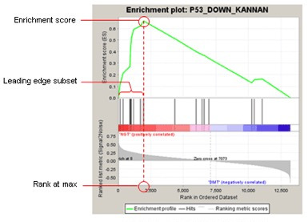
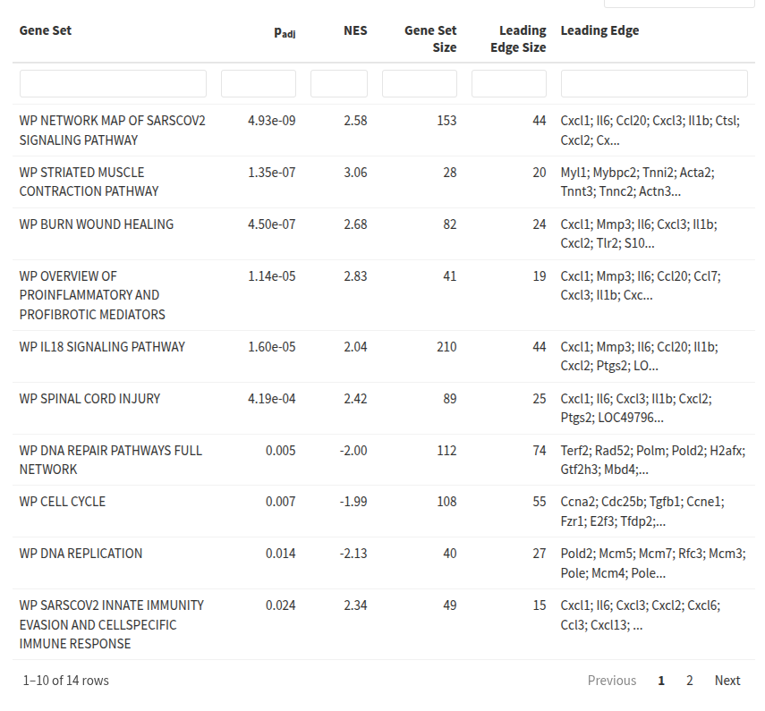
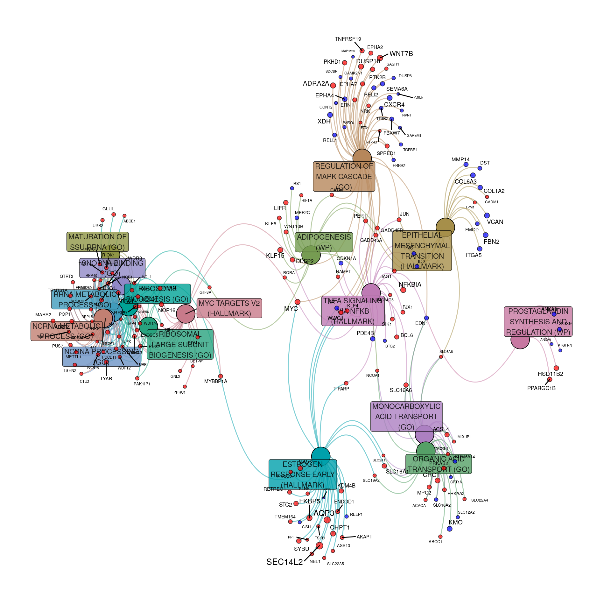

## [Acknowledgement Of Country]{.text-red}

::: {.text-red}

I’d like to acknowledge the Kaurna people as the traditional owners and custodians of the land we know today as the Adelaide Plains, where I live & work.

I also acknowledge the deep feelings of attachment and relationship of the Kaurna people to their place.

I pay my respects to the cultural authority of Aboriginal and Torres Strait Islander peoples from other areas of Australia, and pay my respects to Elders past, present and emerging, and acknowledge any Aboriginal Australians who may be with us today

:::


## Functional Enrichment

- Once we have a list of DE genes $\implies$ what's the biological story?
    + Approach is dependent on the biology under investigation
- Compare to databases which define
    + *Pathways*: KEGG; WikiPathways; Reactome
    + *Structured Ontologies*: Gene Ontology (BP, MF & CC)
    + *Existing Experimental Results*: ImmuneSigDB; VAX
    + Multiple other options

::: {.fragment}
We use enrichment testing on suitable *gene-sets*
:::

## The Gene Ontology Database

:::: {.columns}
::: {.column width='52%'}

```{r gene-ontology, out.width='100%', fig.cap = "https://www.ebi.ac.uk/QuickGO/term/GO:0008327"}
#| echo: false
knitr::include_graphics(here::here("lectures/assets/GO_0008327.png"))
```

:::
::: {.column width='48%'}
- Ontologies: Strictly controlled descriptive syntax
    + Members of a term (i.e. genes) inherit all parent terms
    + Inheritance $\rightarrow$ repetitive gene-sets
- 3 Primary Ontologies
    + Biological Process
    + Molecular Function
    + Cellular Components

:::
::::

## The Kyoto Encyclopedia of Genes and Genomes

:::: {.columns}
::: {.column width='55%'}

```{r kegg, out.width='100%', fig.cap = "https://www.kegg.jp/pathway/map00020"}
#| echo: false
knitr::include_graphics(here::here("lectures/assets/kegg_citrate_cycle.png"))
```

:::
::: {.column width='45%'}
- KEGG database:
    + Pathway topologies
    + Hierarchical relationship between genes
- Pathways (generally) distinct units

:::
::::


## Fisher's Exact Test

- Are genes from a *gene-set* in my DE genes at random or unexpectedly often
    + $H_0:$ No enrichment of genes from a gene-set
    + $H_A$: Some enrichment of genes from a gene-set
- Fisher's Exact Test $\implies$ is there an association between groups in a table
    + Formally tests for independence of rows & columns in a table
    + Usually applied to a $2\times2$ table
- Similar to a $\chi^2$-test but no model assumptions
    + Computationally more demanding

## Fisher's Exact Test  {.slide-only .unlisted}

- A one-tailed Fisher's Exact Test also defines the *hypergeometric distribution*
- If we have white & red marbles in an urn
    + Randomly draw one at a time (without replacing it)
    + Probability of drawing (at least) the exact number of red marbles
    + If we replaced the marble $\implies$ *binomial distribution*


## Fisher's Exact Test {.slide-only .unlisted}

::: {.content-visible when-format="beamer"}
\footnotesize
:::


::: {style='font-size:94%'}

|             | In Gene-set | Not In Gene-set | [Row Totals]{.fragment fragment-index=1 .text-red}  |
|:----------------- | -----------------------:| ----------------------------:| ----------------------:|
| DE Genes    |   $a$   |   $b$   | [$a+b$]{.fragment fragment-index=1 .text-red}  |
| Not DE      |   $c$   |   $d$   | [$c+d$]{.fragment fragment-index=1 .text-red}  |
| [**Column Totals**]{.fragment fragment-index=2 .text-red}  | [$a+c$]{.fragment fragment-index=2 .text-red}  | [$b+d$]{.fragment fragment-index=2 .text-red}  | [$a+b+c+d$]{.fragment fragment-index=3 .text-red}  |

::: {.content-visible when-format="beamer"}
\normalsize
:::

::: {.incremental}

- $p$-value is the probability of observing a 'more-extreme' table than observed *holding marginal totals fixed*
    + This is an exact number $\implies$ no model assumptions
- Perform this test on all selected gene-sets or pathways
- Multiple-testing: FWER control may be better than FDR control
    + FWER (e.g. Bonferroni): $\alpha \implies$ probability of any errors at all
    + FDR (e.g. Benjamini Hochberg): $\alpha \implies$ rate of errors within 'significant' results

:::
:::

## Fisher's Exact Test {.slide-only .unlisted}

::: {.content-visible when-format="beamer"}
\footnotesize
:::


::: {style='font-size:90%'}

|             | In Gene-set | Not In Gene-set | [Row Totals]{.fragment fragment-index=1 .text-red}   |
|:----------- | -----------------------:| ----------------------------:| ----------------------:|
| DE Genes    |       100   |           900   | [100 + 900 = 1000]{.fragment fragment-index=1 .text-red}    |
| Not DE      |       100   |         13900   | [100 + 13900 = 14000]{.fragment fragment-index=1 .text-red}  |
| [**Column Totals**]{.fragment fragment-index=2 .text-red} | [100 + 100 = 200<br>50% DE]{.fragment fragment-index=2 .text-red} | [900 + 13900 = 14800<br>6% DE]{.fragment fragment-index=2 .text-red} | [**1000 + 14000 = 15000**<br>**6.7% DE**]{.fragment fragment-index=3 .text-red} |
:::

::: {.content-visible when-format="beamer"}
\normalsize
:::

::: {.fragment}

- Looks intuitively enriched:
    + 50% of gene set is DE
    + 6% outside of gene set is DE
- The p-value here is `r sprintf("%.2e", fisher.test(matrix(c(100, 100, 900, 13900), nrow = 2))$p.value)`  
- Same result if matrix can be transposed (rows $\leftrightarrow$ columns)
    + Same marginal totals held fixed

:::

## Fisher's Exact Test {.slide-only .unlisted}

- Fisher's Exact Test requires a list of DE genes
    + Also known as an *over-representation analysis*
- Sensitive to hard cutoffs (e.g. $p<0.05$)
    + Is a gene with p = 0.0499 DE whilst one with p = 0.0501 isn't?
- Might also choose top-ranked 100/200/500 if preferable

## Gene Set Enrichment Analysis

:::: {.columns}
::: {.column width='60%'}

- Gene Set Enrichment Analysis (GSEA) [@Subramanian2005-lx] 
    + Uses complete ranked list (e.g. $t$-statistic)
- Walks along ranked list
    + Enrichment score $\uparrow$ if gene in gene-set
    + Enrichment score $\downarrow$ if not in gene-set
- Walk usually performed from either end of list
    + Results implicitly directional

:::
::: {.column width='40%'}

{width='100%'}
:::
::::

## Gene Set Enrichment Analysis {.slide-only .unlisted}

- The Enrichment Score depends on the gene-set size
    + Calculate Normalised Enrichment Score (NES)
- $p$-value obtained uses permutation-based methods
    + Random shuffling of genes and/or samples
    + Can subtly change results between analyses
- Alternatives, e.g. `camera` [@Wu2012-jy], incorporate inter-gene correlations
    
## Additional Approaches

- ROAST (& FRY) perform *Rotation Gene Set Testing* [@Wu2010-qd]
    + *Is there differential expression within the gene-set*?
- Topology-based methods where logFC is propagated through a pathway topology
    + Only suitable for KEGG, WikiPathways etc which contain topologies

## RNA-Seq Specific Challenges

- All above methods developed for microarray technology
- RNA-Seq contains additional biases
    + Longer genes $\implies$ higher counts $\implies$ bias in p(DE)
    + Modifications to hypergeometric models incorporate bias [@Young2010-jw]
    
    
::: {.fragment}

- Most databases classify function at the *gene-level*
    + Transcript-specific function/pathways still poorly understood $\implies$ rarely used

:::
    

## Interpreting Results

:::: {.columns}
::: {.column width='55%'}

:::
::: {.column width='45%'}
::: {style="font-size:90%"}

- Gene Sets tend to share many genes with other gene sets
- The name of the gene-set may be misleading
- Some GSEA results from a Diabetic Bone Fracture experiment in 2018

::: {.fragment}

- Sars-Cov2 not yet identified
    + Gene set likely represents an inflammatory response
    + Wound healing is probably the key

:::
:::
:::
::::

## Interpreting Results {.slide-only .unlisted}

:::: {.columns}
::: {.column width='55%'}

:::
::: {.column width='45%'}
::: {style="font-size:90%"}

- Network-based approaches can simplify interpretation
- Cluster of pathways on the left represents the same collection of genes
    + Associated with ribosomal processes

::: {.incremental}
    
- Prostaglandin Synthesis (on right) is clearly a distinct set of genes
- 2x Acid Transport gene-sets (bottom-right) may suggest overlapping processes

:::
:::
:::
::::

# References

##

::: {.content-visible when-format="beamer"}
\begingroup
\scriptsize
:::

<!-- This is where the bibliography gets injected -->
:::{#refs}
:::

::: {.content-visible when-format="beamer"}
\endgroup
:::
