## [Acknowledgement Of Country]{.text-red}

::: {.text-red}

I’d like to acknowledge the Kaurna people as the traditional owners and custodians of the land we know today as the Adelaide Plains, where I live & work.

I also acknowledge the deep feelings of attachment and relationship of the Kaurna people to their place.

I pay my respects to the cultural authority of Aboriginal and Torres Strait Islander peoples from other areas of Australia, and pay my respects to Elders past, present and emerging, and acknowledge any Aboriginal Australians who may be with us today

:::
# Introduction

## High Resolution Technologies

- Microarray and early RNA-Seq analysis used 'bulk' tissues
- Very hard to obtain pure cell-types in most samples 
    + T cells sorted by FACS still heterogeneous
    + Cancer biopsies are heterogeneous
    + Immortalised cell-lines (HeLa, HEK293 etc.) differentiate into multiple cell types
    
::: {.incremental}

- Single-Cell RNA-Seq (scRNA-Seq) $\implies$ RNA can be associated with "cell of origin"
    + Identify cell-types within a sample
- Spatial Transcriptomics $\implies$ Identify cell-types on a slide by location
    + Doesn't always utilise sequencing

:::

## High Resolution Technologies {.slide-only .unlisted}

- Quite a different set of questions to bulk tissue

::: {.incremental}
- Is differential expression large in a subset of cells?
    + Which cells are they?
    + Or small in all cells?
- Difference between cell-types and cell-state
- How do cells travel through differentiation trajectories?
- Which cells are co-localised within tissue samples?
    + And where are the transcripts within a cell?
- Which cells are communicating with which other cells?

:::

# Single Cell RNA-Seq

## Single Cell RNA-Seq

::: {.notes}
- The key challenge has been how to isolate individual cells then how to obtain enough material to sequence and assign all reads to the correct cell
- The technology needs to address throughput in terms of sequencing depth, but also in cell numbers
    + Growth in capacity to increase cell numbers has been roughly exponential
    + Data can get very large 
- High failure rate when capturing RNA
    + Zero reads for a gene within a cell is no longer a reliable marker of no expression
    
:::

```{r scrna-timeline, fig.cap = "Figure from @Svensson2018-rs", fig.align='left', out.width='90%'}
#| echo: false
knitr::include_graphics(here::here("lectures/assets/scRNATimeline.jpg"))
```

## Single Cell RNA-Seq {.slide-only .unlisted}

Four basic scRNA technologies

1. Droplet-based (e.g. 10x Genomics, Drop-Seq):
    + Cells captured in micro-droplets $\rightarrow$ barcoded $\rightarrow$ lysed
2. Plate-based (e.g. SMART-Seq2)
    + Individual cells captured in *microwells* 
3. Gel/Emulsification-based
    + Similar to droplet but performed in solution
4. Pooling & Splitting (e.g. SPLIT-Seq)
    + Multiple wells with distinct barcodes
    + Cells pooled $\rightarrow$ split $\rightarrow$ next barcode
    
## Single Cell RNA-Seq {.slide-only .unlisted}

| **Protocol** | **C1 (SMART-Seq)** | **SMART-Seq2** | **10X Chromium** | **SPLIT-Seq** |
|:-------- |:-------------- |:---------- |:------------ |:--------- |
| *Platform* |  Microfluidics | Plate-based   | Droplet | Plate-based |
| *Transcript* | Full-length  | Full-length   | 3’-end  | 3’-end |
| *Cells* | 10^2^ − 10^3^     | 10^2^ − 10^3^ | 10^3^ − 10^4^ | 10^3^ − 10^5^ |
| *Reads/Cell* | 10^6^        | 10^6^         | 10^4^ − 10^5^ | 10^4^         |

Table: Data sourced from @Haque2017-ae

<br>
Tradeoff is between *cell numbers*, *transcripts per cell*, *full length vs 3'*, *cost* etc

## Droplet-Based scRNA 

::: {.notes}
- Have already dissociated cells
:::

```{r droplet, fig.align='left', out.width='100%'}
#| echo: false
knitr::include_graphics(here::here("lectures/assets/chromium-partitioning-library-prep.png"))
```

::: {.fragment}

:::: {.columns}
::: {.column}

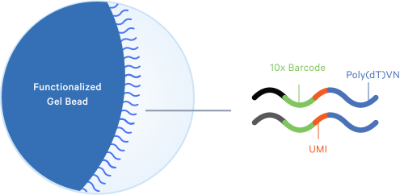{fig-align='left' width='100%'}
:::
::: {.column}
- GEM: Gel bead in EMulsion
- Primers can capture 3', 5' or targeted sequences
- Figures from www.10xgenomics.com
:::
::::

:::


## Droplet-Based scRNA {.slide-only .unlisted}

::: {.content-hidden when-format="beamer"}


:::

::: {.fragment}

:::: {.columns}
::: {.column width='40%'}
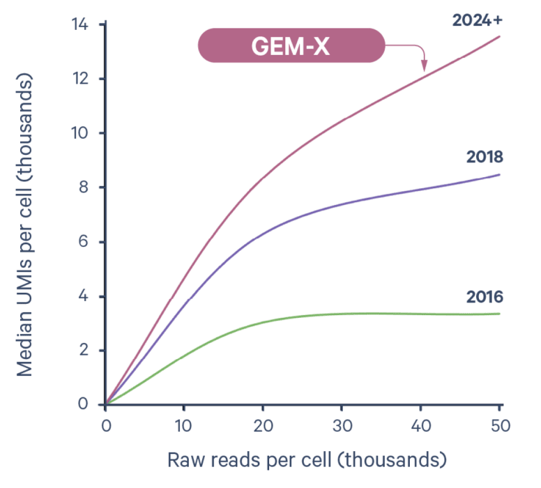

::: 

::: {.column width='60%'}
- UMIs represent individual RNA molecules
- Now capturing ~14,000 transcripts/cell

::: 

:::: 
:::

<!-- ## SPLIT-Seq -->

<!-- :::: {.columns} -->
<!-- ::: {.column} -->
<!-- 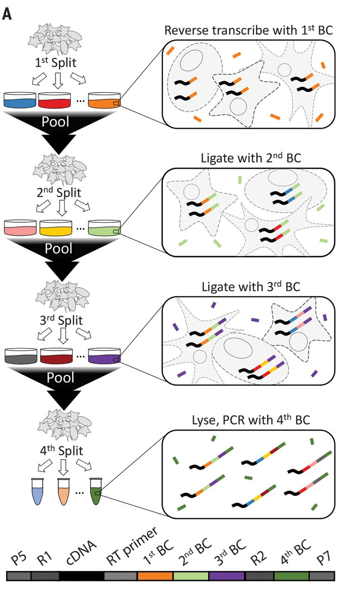{width='60%'} -->
<!-- ::: -->

<!-- ::: {.column} -->

<!-- SPLIT-Seq is an alternative, plate based scRNA method -->

<!-- - Cells are split into pools and fixed -->
<!-- - One barcode/pool -->
<!-- - Multiple rounds of pooling and barcoding -->
<!-- - All amplification is *in situ* -->

<!-- ::: -->
<!-- :::: -->


<!-- ## CITE-Seq -->

<!-- - Cellular Indexing of Transcriptomes and Epitopes by sequencing (CITE-Seq) [@Stoeckius2017-od] -->
<!--     + Designed for Droplet-based methods -->
<!-- - Extends scRNA using labelled antibodies for cell-surface proteins -->
<!-- - Antibodies labelled with oligo tags -->
<!-- - Oligos are amplified along with RNA after cell lysis -->


## Data Processing

- Most pre-processing for 10X data is performed using CellRanger
- Handles demultiplexing, alignment (STAR) and quantification (using UMIs)
    + Full-length transcript methods can utilise kallisto/salmon
- We end up with a feature-barcode matrix
    + A barcode represents an individual cell (or a set of reactions)
    + A feature is commonly thought of as a gene in scRNA-Seq
- Similar to counts from bulk RNA-Seq but with many more columns (cells)
    + Also many more zero counts for genes
    + Multiple cells from multiple biological replicates

## Filtering Stages

- The aim is to keep the *high quality cells* and discard the dubious cells, such as:
    1. Low/High read numbers (library sizes)
    2. Low feature/gene numbers
    3. High proportions of mitochondrial RNA $\implies$ cells broken prior to lysis
    4. Doublets (i.e. two cells instead of a single cell)

::: {.fragment}
    
- Also filter for genes considered as detectable (Average Counts > 1)
    + Some zero counts are from unexpressed genes
    + Others are "dropouts" $\rightarrow$ RNA capture efficiency between 10-40%

:::

## Normalisation

```{r variability, fig.cap = "Image from @Cuevas-Diaz-Duran2024-zc", fig.align='left', out.width='60%'}
#| echo: false
knitr::include_graphics(here::here("lectures/assets/12864_2024_10364_Fig2_HTML.png"))
```

::: {.fragment}
- Bulk-RNA normalisation methods no longer applicable 
    + Does each cell (or cell-type) have the same starting amount of RNA?
- Normalisation strategies may be platform dependent
    + Gene length impacts full-length methods but not droplet-based (3' or 5')
- Should missing values be imputed?

:::

## Identifying Cell Types

:::: {.columns}
::: {.column}
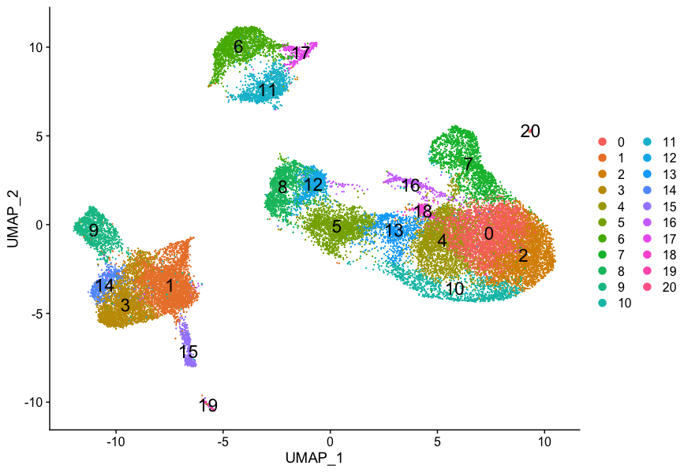
:::
::: {.column}
- A key aim is to identify different cell types in our sample
- How many cell types are there really?
- How similar are cell types?
- What genes drive the differences <br> $\rightarrow$ Differential Expression

::: {.incremental}
1. Dimensional Reduction
2. Clustering Cells
:::

:::
::::

## Principal Component Analysis

- scRNA (+ bulk RNA) are high dimensional datasets
    + e.g. 1,000 cells $\times$ 15,000 genes
- How do we see how similar cells are to each other?
    + Is there a way to summarise distances between cells?
    + Can we visualise in 2-dimensions?
    
::: {.incremental}
- Principal Component Analysis (PCA) identifies direction of maximum variance
    + Known as PC1
- The we find the next most variable (orthogonal) direction $\implies$ PC2
- Data is rotated around PC1, then PC2 etc
- Comparing PC1 vs PC2, PC2 vs PC3 etc allows 2D (or 3D) visualisation
:::
    
## Principal Component Analysis {.slide-only .unlisted}

:::: {.columns}
::: {.column width='30%'}
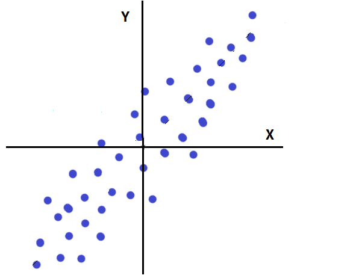
:::
::: {.column width='30%'}
::: {.fragment}
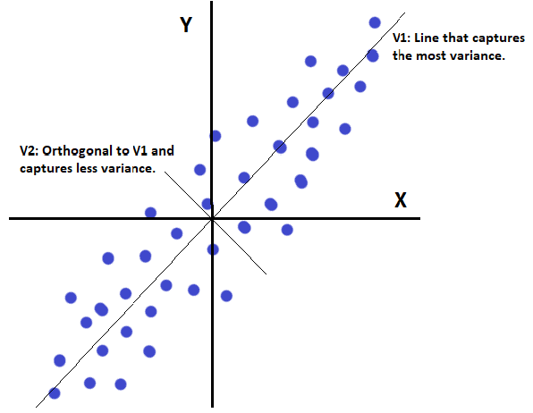
:::
:::
::: {.column width='40%'}
<br>

::: {.fragment}
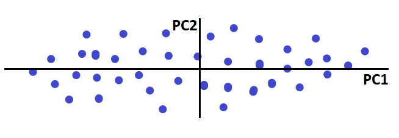
:::
:::
::::


::: {.fragment}

- The main directions of variability are hopefully related to the biology
- Rotations along PC1 vs PC2 should show separation by biology of interest


::: {.content-visible when-format="beamer"}
\tiny
:::

[Figures taken from https://statisticsbyjim.com/basics/principal-component-analysis/]{style="font-size:60%"}

::: {.content-visible when-format="beamer"}
\normalsize
:::

:::

## Clustering of Cells

:::: {.columns}

::: {.column width='45%'}

- To form clusters $\implies$ use top principal components
- Often use k-nearest-neighbour (kNN) graph methods to form clusters
- Methods like UMAP highlight clusters during visualisation

:::

::: {.column width='55%'}

:::

::::

::: {.fragment}

- Huge number of possible parameters $\implies$ subjective approach to data

:::

## Marker Detection

:::: {.columns}

::: {.column width='45%'}
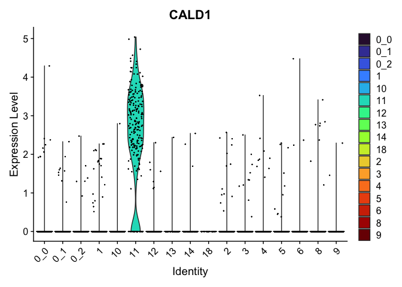
:::

::: {.column  width='45%'}
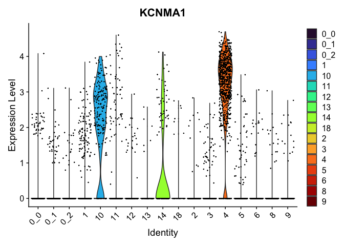

:::

::::

- Find genes unique to a given cluster or shared across multiple clusters

::: {.content-visible when-format="beamer"}
\tiny
:::

[Figures taken from https://ucdavis-bioinformatics-training.github.io/2023-June-Single-Cell-RNA-Seq-Analysis]{style="font-size:60%"}

::: {.content-visible when-format="beamer"}
\normalsize
:::


## Cluster Annotation

:::: {.columns}

::: {.column width='55%'}

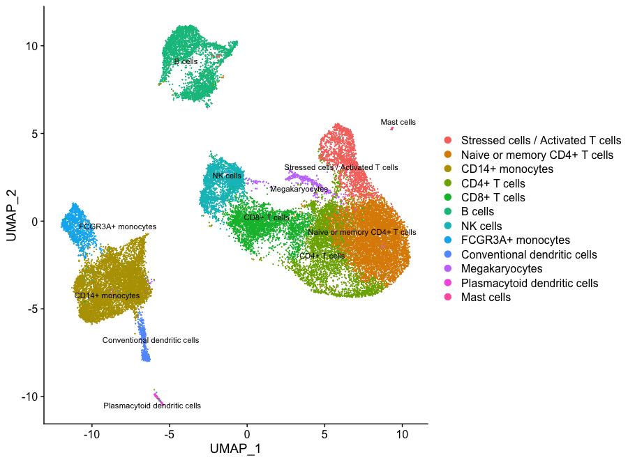

:::

::: {.column width='45%'}

- Use our expert knowledge of known marker genes to annotate clusters
- CITE-Seq uses cell-surface antibodies to aid this step
- Can drill deeply into cell-type differences & communication
    - Complementary receptor-ligand expression

:::

::::

# Spatial Transcriptomics

## Spatial Transcriptomics

- Even single cell RNA dissociates cells from position with tissues
- Cells function within highly structured tissue environments
    + Cells are likely to have different communication dynamics based on location
- *Spatial transcriptomics* attempts to resolve this limitation


## Early Spatial Transcriptomics

- First appeared using barcoded primers with fixed location [@Stahl2016-bx]
    + ~100 $\mu$m resolution
- Tissue affixed to prepared slide:
    + Stained & Visualised
    + Made Permeable
    + RT-PCR $\implies$ cDNA
    + Tissue removed enzymatically 
    + Barcoded cDNA $\implies$ sequencing
    
## Approaching Single Cell Resolution
    
- 10X Visium now down to 100 $\mu$m resolution
- *Slide-seq* [@Stickels2021-zf]: Barcoded beads $\rightarrow$ ~10$\mu$m resolution
    + Approaching single cell resolution
    + Deconvolution of beads  single cell
- Stereo-Seq [@Chen2022-rn]: etched grid on slide $\implies$ resolution of ~200nm
- Seq-Scope [@Cho2021-og]:<br> Tissue placed directly on modified Illumina flow-cell $\implies$ resolution ~500nm 

## Beyond Sequencing

- Barcoded probes via Fluorescence In Situ Hybridisation enable a sequencing-free perspective
- Staining technologies used to identify cell boundaries, nuclei etc
- MERFISH: multiplexed error-robust FISH [@Chen2015-qa]
    + Sequence specific barcodes able to detect ~10,000 transcripts
    + Directly count specific transcripts 
    + Location within cell also identified

::: {.fragment}
- Extremely rapid technological development (also \$\$\$)
- Methods often lag technology somewhat
:::

## Examples of 10X Xenium Spatial Transcriptomics

::: {.notes}
- Uses a pre-design panel of probes to detect genes
- Padlock-based, rolling circle amplification $\implies$ fluorescence
:::

```{r xenium, fig.cap = "Taken from https://xenium.10xgenomics.com. Highlighting CD4 in human kidney", out.width='80%', fig.align='left'}
#| echo: false
knitr::include_graphics(here::here("lectures/assets/xenium_cd4.png"))
```

## Examples of 10X Xenium Spatial Transcriptomics {.slide-only .unlisted}

:::: {.columns}
::: {.column width='45%'}
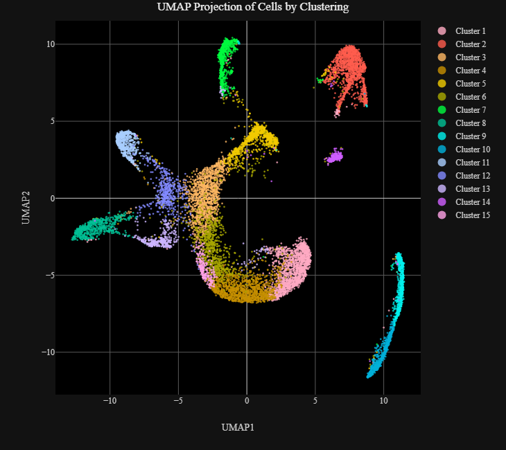
:::
::: {.column width='45%'}
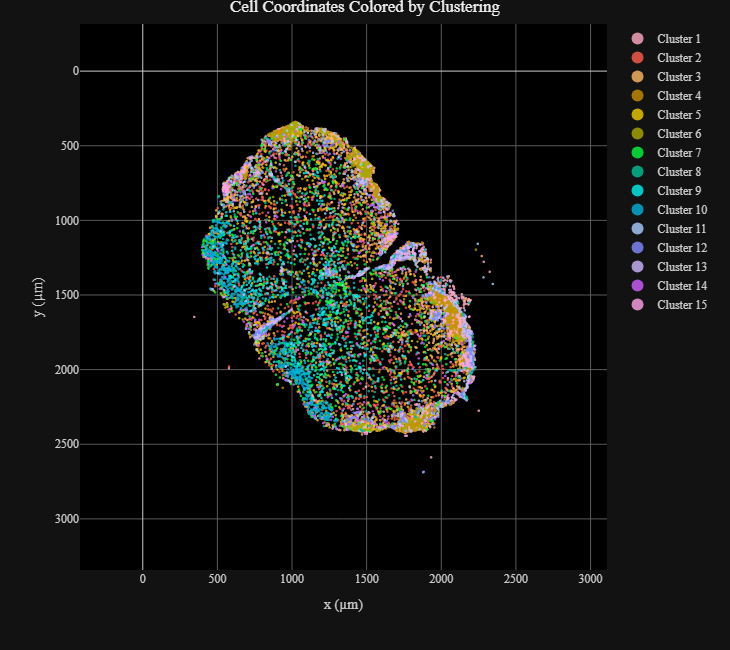
:::
::::

::: {.content-visible when-format="beamer"}
\tiny
:::

[Images courtesy of Megan Monaghan. PhD Candidate, Comerford Lab. Adelaide University]{style="font-size:60%"}

::: {.content-visible when-format="beamer"}
\normalsize
:::


## Additional Reading

- [StatQuest: Principal Component Analysis (PCA)](https://www.youtube.com/watch?v=FgakZw6K1QQ)
- [StatQuest: K-nearest neighbors, Clearly Explained](https://www.youtube.com/watch?v=HVXime0nQeI)
- [StatQuest: UMAP Dimension Reduction, Main Ideas!!!](https://www.youtube.com/watch?v=eN0wFzBA4Sc)


# References

##

::: {.content-visible when-format="beamer"}
\begingroup
\scriptsize
:::

<!-- This is where the bibliography gets injected -->
:::{#refs}
:::

::: {.content-visible when-format="beamer"}
\endgroup
:::
