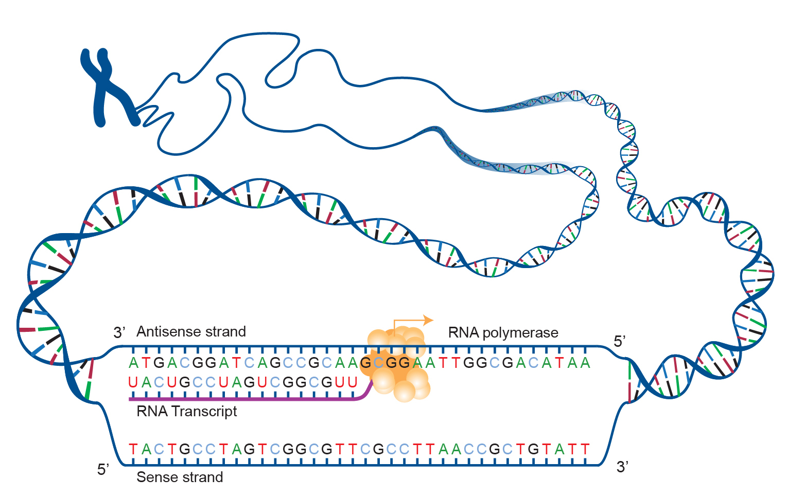
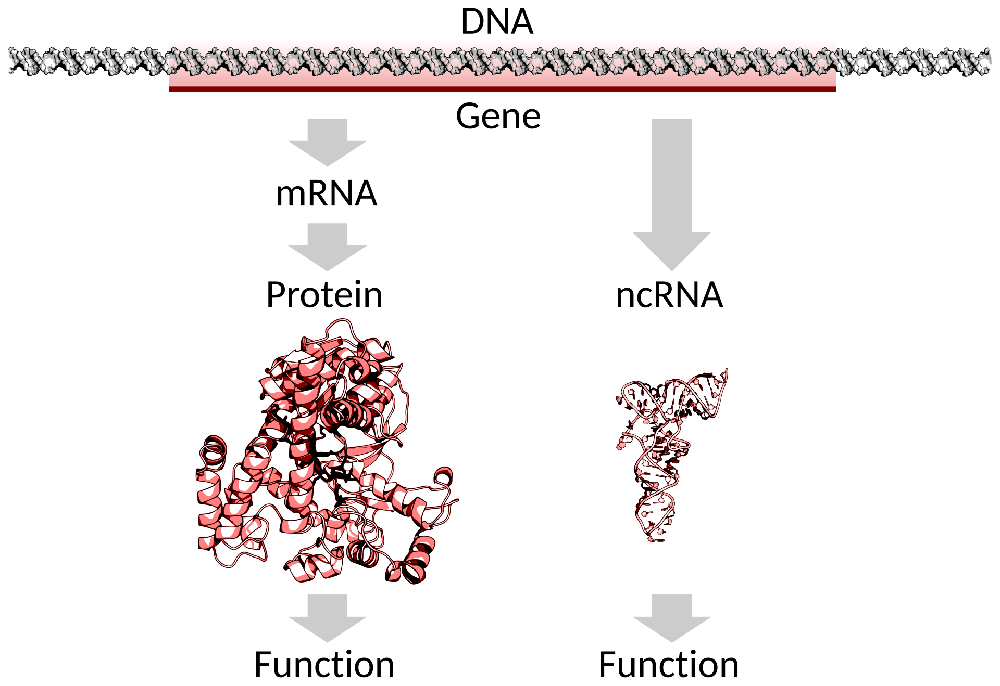
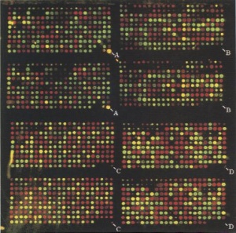

## [Acknowledgement Of Country]{.text-red}

::: {.text-red}

I’d like to acknowledge the Kaurna people as the traditional owners and custodians of the land we know today as the Adelaide Plains, where I live & work.

I also acknowledge the deep feelings of attachment and relationship of the Kaurna people to their place.

I pay my respects to the cultural authority of Aboriginal and Torres Strait Islander peoples from other areas of Australia, and pay my respects to Elders past, present and emerging, and acknowledge any Aboriginal Australians who may be with us today

:::

# What Is Transcriptomics

## What Is Transcriptomics?

> Transcription is the process of making an RNA copy of a gene sequence

::: {.fragment}

:::: {.columns}

::: {.column width='42%'}


- DNA can be described as being like a giant book of instructions

- Some regions are defined as *genes*
    + Originally considered to be the basic unit of inheritance
    + Now used to describe a region of DNA transcribed into RNA
    
:::

::: {.column width='58%'}

::: {style="font-size: 90%; text-align: center;"}



:::

:::

::::

:::

[^1]: https://openoregon.pressbooks.pub/mhccbiology102/chapter/transcription/

## What Is Transcriptomics? {.slide-only .unlisted}

> Transcriptomics is the study of transcribed RNA

::: {.fragment}

:::: {.columns}

::: {.column width='52%'}

Transcribed RNA falls into 2 broad classes

1. Messenger RNA (mRNA) 
    + Codes for protein sequences
2. Non-coding RNA (ncRNA)
    + Multiple types of *functional* RNA
    + rRNA, tRNA $\implies$ protein translation
    + lncRNA, miRNA, snRNA, piRNA etc
    
Prokaryotes $\implies$ mRNA, rRNA & tRNA

::: {.content-visible when-format="beamer"}
\vspace{1em}
:::


:::
::: {.column width='48%'}


::: {style="font-size: 60%; text-align: center;"}


<br>By <a href="//commons.wikimedia.org/wiki/User:Evolution_and_evolvability" title="User:Evolution and evolvability">Thomas Shafee</a> - <span class="int-own-work" lang="en">Own work</span>, <a href="https://creativecommons.org/licenses/by/4.0" title="Creative Commons Attribution 4.0">CC BY 4.0</a>, <a href="https://commons.wikimedia.org/w/index.php?curid=39441809">Wikimedia Link</a>

:::
:::

::::

:::

## Functional RNA

:::: {.columns}

::: {.column width='60%'}

{fig-align="left"}
:::

::: {.column width='40%'}
(An incomplete list)

- pre-mRNA + mRNA
- lncRNA + lincRNA
- miRNA, siRNA, shRNA, piRNA
- rRNA + tRNA
- snRNA + snoRNA
- SRP RNA
- eRNA
- circRNA
:::

::::

## The RNA Population Of a Eukaryotic Cell

:::: {.columns}

::: {.column width='60%'}

```{r rna-types, echo = FALSE, fig.cap = "Image taken from @ijms19051310", out.width='92%', fig.align='left'}
knitr::include_graphics(here::here("lectures/assets/eukaryotic_rna_types.png"))
```


:::
::: {.column width='40%'}

<br>

::: {.content-visible when-format="beamer"}
\vspace{2em}
:::

- rRNA $\approx$ 80%^1^
- tRNA $\approx$ 15% 
- All other RNA $\approx$ 5%
<br><br>

::: {.content-visible when-format="revealjs"}
::: {style="font-size:60%"}
1. https://bionumbers.hms.harvard.edu/bionumber.aspx?s=n&v=5&id=100264

:::
:::

::: {.content-visible when-format="beamer"}
\vspace{2em}
\tiny ^1^ https://bionumbers.hms.harvard.edu/bionumber.aspx
:::


:::

::::


## Eukaryotic mRNA Processing

- Nuclear mRNA have 5' cap added
    + Protects single-stranded mRNA from degradation
    + Regulates nuclear export
    + Promotes translation into protein
    
::: {.fragment}
- mRNAs are polyadenylated at the 3' end (-AAAAAAAAAAAAA)
    + Also protects from degradation
    + Aids in transcription termination, export and translation
    
:::
::: {.fragment}
- Introns are spliced out as required    
:::


## Eukaryotic mRNA Processing {.slide-only .unlisted}

```{r mrna-processing, echo = FALSE, fig.cap="Taken from @Shafee2017-zv", fig.align='left', out.width='80%'}
knitr::include_graphics(here::here("lectures/assets/eukaryotic_mrna_processing.png"))
```

## Eukaryotic mRNA Processing {.slide-only .unlisted}

```{r alt-splicing, echo = FALSE, fig.cap="Image by the National Human Genome Research Institute", fig.align='left', out.width='80%'}
knitr::include_graphics(here::here("lectures/assets/DNA_alternative_splicing.png"))
```


# Why Study Transcriptomics? 

## Why Study Transcriptomics? 

::: {.notes}
- Can infer specific cell-cell communication methods
- Identify therapeutic targets for Cardiovascular Disease, biomarkers for CAR-T cells etc
:::

- Assumed to be low-level
    + DNA $\rightarrow$ [RNA]{.text-red} $\rightarrow$ Protein $\rightarrow$ Metabolites, Signalling molecules, etc ...
- Is a snapshot of highly **dynamic biological processes**
    + Captures response to stimulus and steady-state dynamics
    + Also changes in steady-state over time
- RNA expression is a rapid, early response to stimuli
    + Could be immune signalling, drug treatment etc
- Use to make inference about these biological processes of interest


## Quantitative Approaches

::: {.notes}
- First trimester placenta is hypoxic $\implies$ later is normoxic
- How a disease associates with aging
:::


- Change in a gene's transcriptional activity $\implies$ change in RNA abundance
    + Capturing changes in abundance $\implies$ **measure RNA quantities**

::: {.fragment}
    
- Changes in splicing patterns
    + Require methods for quantifying isoforms *within* a gene
    + May be changing proportions within gene-level abundances

:::
    
## Sequence Based Approaches

- Identify novel transcript sequences
- No reference genome/transcriptome
    + Compare novel sequences against known transcriptomes $\implies$ infer function
- Unexpected splicing patterns and chimeric RNA
    + Real genomes are less "neat" than reference genomes
    + Can play a key role in leukaemias & other cancers $\implies$ clinical diagnostic

# The Development of Transcriptomics

## Early Transcriptomics

- The field developed with few reference sequences
    + Human Genome Project (1990-2003)
- Single sequence methods
    + Sequence Identification: Sanger Sequencing (1977)
    + Quantitative: Northern Blot (1977) + qPCR (1996)
    
::: {.fragment}
    
- High-Throughput Era
    + Sequence Identification: ESTs (1991)
    + Quantitation: SAGE (1995) $\rightarrow$ Microarrays (1996)

:::

## Northern Blots

:::: {.columns}
::: {.column width='65%'}

```{r northern-blot, echo = FALSE, out.width = '100%', fig.align = 'left', fig.cap = "Figure taken from https://www.genome.gov/genetics-glossary/Northern-Blot"}
knitr::include_graphics(here::here("lectures/assets/Northern-blot.jpg"))
```

:::

::: {.column width='35%'}
::: {style='font-size:85%;'}
- Probes require sequence knowledge
- Clear Presence/Absence calls
- Crude quantitation: Densitometric Analysis
:::
:::

::::

## Expressed Sequence Tags (ESTs)

::: {.notes}
- The senior author on the EST paper was J Craig Ventner who played an important role in the Human Genome Project
:::

- The first attempt at capturing the larger transcriptome was ESTs [@1991VenterEST]
- Identified 609 human brain mRNA sequences
    + Selected for polyA-mRNA then reverse transcribed
    + Used random primers $\rightarrow$ Sanger Sequencing
- 10 years before the Human Genome Project
    + Gene discovery was a hot topic

## RT-qPCR

::: {.notes}
The C~T~ values is actually estimated to a decimal value
:::

- “Gold-standard” for measurement of transcription levels
    + Single gene $\implies$ not a high-throughput technique
- Targets a single transcript region with specific primers to produce cDNA <br>$\rightarrow$ Polymerase Chain Reaction (PCR)
- Each PCR cycle approximately doubles the target region
    
::: {.fragment}    
- cDNA produced is identified using fluorophores
    + Fluorescence doubles with each cycle
- Once fluorescence passes a detection threshold, the cycle number is recorded
    + Known as the Cycle Threshold (C~T~) value

:::

## RT-qPCR {.slide-only .unlisted}

```{r rt-pcr, echo = FALSE, out.width = '70%', fig.align = 'left', fig.cap = "A 10-fold dilution series"}
knitr::include_graphics(here::here("lectures/assets/qPCR.png"))
```


## RT-qPCR {.slide-only .unlisted}

- Higher C~T~ values $\implies$ lower numbers of target molecule at the beginning
- These can be used to estimate and compare abundance levels (i.e. gene expression)

::: {.fragment}
- Is vulnerable to technical artefacts (e.g. pipetting variability, RNA instability etc)
- Often includes one or more "housekeeper" genes thought to be stably expressed
- C~T~ values are *normalised* to the housekeeper genes $\implies C_{T_{hk}}$
    + log~2~ transformed values are used: $\Delta C_T = \log_2 C_{T_g} - \log_2 C_{T_{hk}}$
:::

## RT-qPCR {.slide-only .unlisted}

- We commonly compare abundances across experimental groups
    + e.g. Untreated/Control vs Treated
- In RT-PCR this is $\Delta\Delta C_T$ $\implies$ the change in $\Delta C_T$ values [@LIVAK2001402]
    + RNA compared after normalisation
- Different RNA abundances $\implies$ *Differential Gene Expression*
- We have used the $\log_2$ scale $\implies$ log Fold-Change (logFC)

## Serial Analysis of Gene Expression (SAGE)

- First high-throughput quantification method was *Serial Analysis of Gene Expression* (SAGE) [@pmid7570003]

:::: {.columns}

::: {.column width="42%"}
::: {style="font-size: 80%; text-align: center;"}
, via Wikimedia Commons](assets/SAGE.png)
:::
:::

::: {.column width="58%"}

- mRNA $\rightarrow$ cDNA using biotinylated primers
- cDNA bound to beads (using biotin) & cleaved 
- 11mer "tags" were ligated into long sequences using linker sequences
- Sequenced using Sanger Sequencing
- Deconvolution & counting

::: {.incremental}
- First count-based transcriptomic methods developed
:::

:::

::::

## Microarray Technology

::: {style='font-size:90%'}

:::: {.columns}

::: {.column width='40%'}


{width="100%" fig-align="left"}

:::

::: {.column width='60%'}

- Truly launched the modern transcriptomics era
- Quantified thousands of transcripts simultaneously
- Relied on development of Human Genome Project <br>(+ other organisms)
- Analysis in R/Bioconductor
    + R v1.0.0 (2000) 
    + Bioconductor [@Gentleman2004-sd]
    + Modern statistical high-throughput models developed
    
:::


::::

:::

# References

##

::: {.content-visible when-format="beamer"}
\begingroup
\scriptsize
:::

::: {.content-visible when-format="revealjs"}
<!-- (no special size adjustment for HTML) -->
:::

<!-- This is where the bibliography gets injected -->
:::{#refs}
:::

::: {.content-visible when-format="beamer"}
\endgroup
:::
