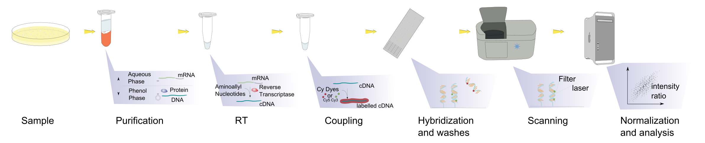
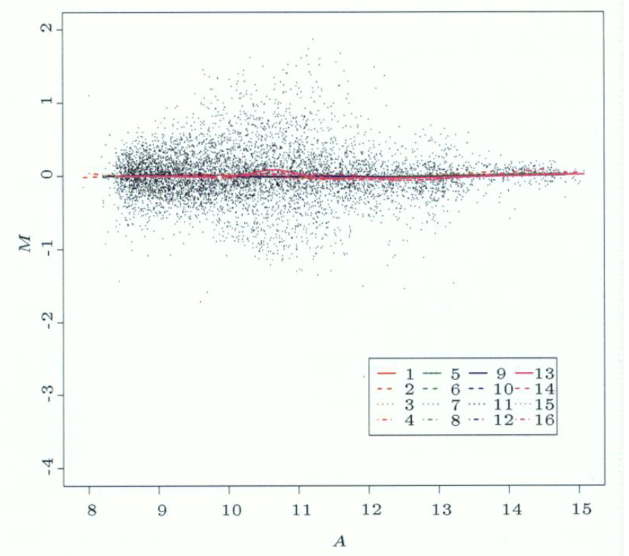
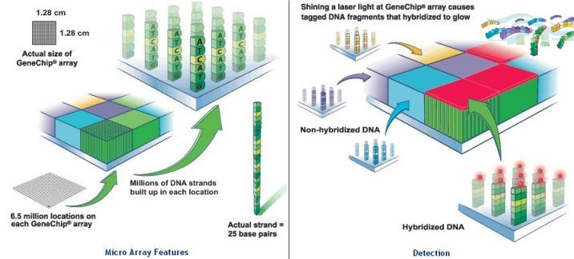
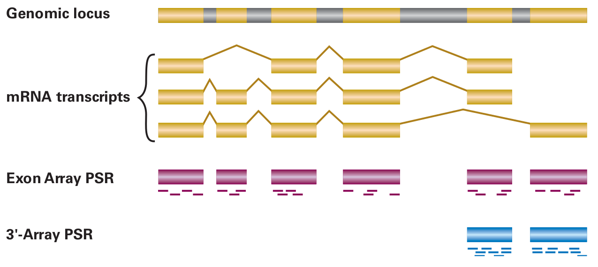
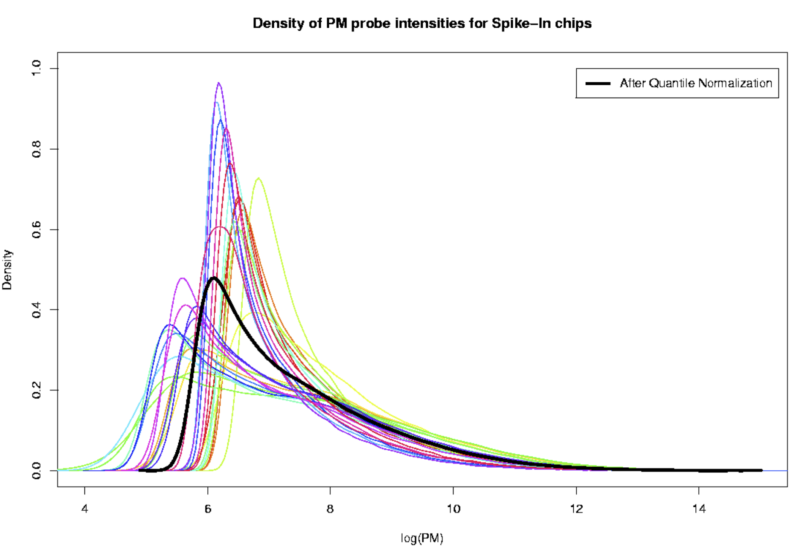
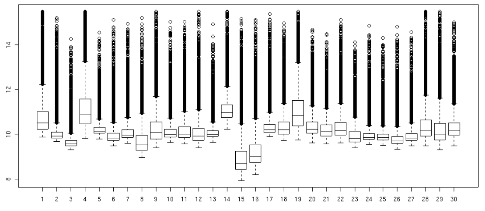
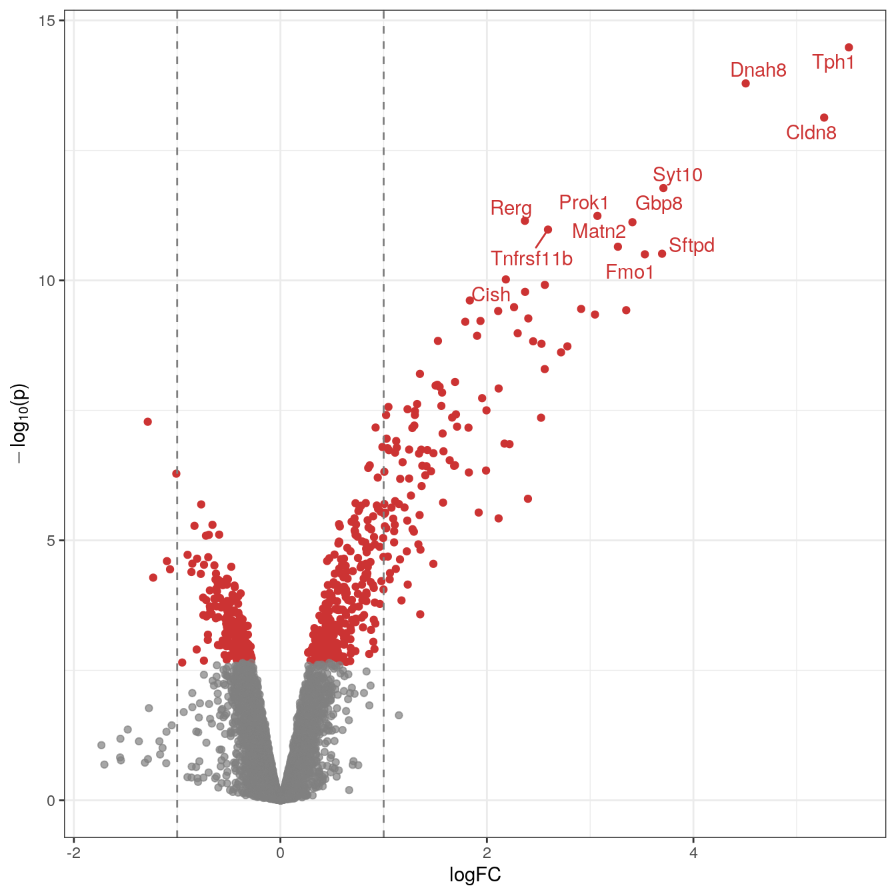

## [Acknowledgement Of Country]{.text-red}

::: {.text-red}

I’d like to acknowledge the Kaurna people as the traditional owners and custodians of the land we know today as the Adelaide Plains, where I live & work.

I also acknowledge the deep feelings of attachment and relationship of the Kaurna people to their place.

I pay my respects to the cultural authority of Aboriginal and Torres Strait Islander peoples from other areas of Australia, and pay my respects to Elders past, present and emerging, and acknowledge any Aboriginal Australians who may be with us today

:::

# Technology Development

## Microarray Technology

- Marked the birth of the modern transcriptomics era (~1996)
    + Thousands of genes analysed simultaneously
    + Microarrays are still in use!
- Developed alongside Human Genome Project (+ other organisms)
    + Reference genome was nearing completion
    + Gene/Transcript sequences available at scale
- Focus was quantitative analysis $\implies$ *differential gene expression*

## Microarray Technology  {.slide-only .unlisted}
    
- Compute resources were increasing rapidly
    + CPU multi-threading becoming commonplace
    + `python 2.0` released in 2000
    + `R` v1.0.0 released in 2000
    + Bioconductor release 1.0 in 2002
    + High Performance Computing (HPC) becoming accessible

## Microarray Technology  {.slide-only .unlisted}

- Probes complementary to target sequence positioned on array
- RNA $\rightarrow$ fluorescently labelled cDNA

::: {.incremental}

1. Labelled cDNA binds to probe
2. Microarray excited with laser
3. Fluorescence at a given probe $\propto$ target RNA abundance

:::


::: {.fragment}


```{r rna-types, echo = FALSE, fig.cap = "Image courtesy of Squidonius, Public domain, via Wikimedia Commons", out.width='75%', fig.align='left'}

```

:::


## Two Colour Arrays

:::: {.columns}

::: {.column width="42%"}


{width="100%" fig-align="left"}

:::

::: {.column width="58%"}

- Two colour microarrays were printed microscope slides
- Known probe sequences were *printed* to the surface in defined locations
    + 60-75mer oligonucleotide probes
    + Highly customisable by project
    
::: {.fragment fragment-index=1}
- Two samples per array
    + Samples labelled with Cy5 (Red) or Cy3 (Green)
- Scanned at 570nm (Cy3) and 670nm (Cy5)

:::

:::


::::

## MA Plots

:::: {.columns}
::: {.column}

:::
::: {.column}
- Mean of Differences<br>$M = \log_2(\frac{R}{G}) = \log_2(R) - \log_2(G)$
- Average Signal<br>$A = \frac{1}{2}\log_2(RG) = \frac{\log_2(R) + \log_2(G)}{2}$

::: {.fragment}
- Assess bias within and between arrays
- Also to show DE genes
:::
::: {.fragment}
- Term "MA Plot" still used in RNA-Seq despite no connection to formula
:::
:::
:::: 

## Single Channel Arrays

:::: {.columns}


::: {.column width="45%"}
::: {style="font-size: 80%"}
, via Wikimedia Commons](assets/Affymetrix.jpg)
:::
:::

::: {.column width="55%"}


- Affymetrix Arrays became dominant
    + Factory manufactured
- Standardised layout for each organism
- Single sample per array
    + Only scanned at one frequency<br>$\implies$ no dye bias
- More genes/array

- 25mer probes targeting 3' end of transcript
    + Captured only intact transcripts

:::

::::

## Single Channel Arrays  {.slide-only .unlisted}

:::: {.columns}

::: {.column width='85%'}

<br>

{width="100%"}

:::
::::

## 3' Arrays

- Each 3' exon targeted by 11 unique 25mer probes $\implies$ *a probeset*
- Possible to detect different transcripts only if 3' exons differ

::: {.incremental}
- *Perfect Match* (PM) probes $\implies$ exactly matches target sequence
    + Known to capture off-target signal $\implies$ non-specific binding (NSB)
- 3' arrays include paired *mismatch* probes (MM) with a change at the 13th position
    + Literally half the array
    + Intended to quantify NSB properties of each probe
    + Sometimes returned more signal than PM probes &#129322;
<!-- - Gene-level expression estimate obtained taking a robust average across probeset -->
<!--     + Model also included BG signal (but not always from MM probes) -->
    
:::

## Other Array Types

:::: {.columns}

::: {.column width='45%'}

- 3' Arrays replaced by whole transcript (WT) arrays
    + Exon/Gene Arrays
    + Maximum of 4 probes/exon
    + Multiple probes target missing exons
- Illumina Bead arrays
    + 65-mer probes
    + Used barcoded beads instead of set probe locations

::: 

::: {.column width='55%'}

::: 

::::

# Differential Gene Expression

## Motivation

- The aim is to detect *differentially expressed* (DE) genes
- Classic design is Control samples vs Treated samples e.g.
    + Resting T cells vs Stimulated T cells
    + T47D + Estrogen vs T47D + Estrogen + Testosterone
- What genes are DE between conditions
- Need replicates for each condition $\implies t$-test for each gene
    + Anything with $n < 3$ per condition is unacceptable
    + What values do we use for $t$-test? 
    
## Quantile Normalisation

:::: {.columns}
::: {.column width='55%'}
{fig-align="left"}
:::
::: {.column width='45%'}

- Need to summarise probes to a probeset
    + Probes can be very noisy
    + BG signal + inconsistent binding
- Individual arrays give different fluorescence distributions $\implies$ technical noise
    + Normalisation between arrays
<!-- - $t$-tests require an estimate of fold-change + standard error of estimate -->

:::
::::

## Quantile Normalisation {.slide-only .unlisted}

- Quantile normalisation is perfect for arrays with probes and probesets
    + Normalise probe-level signal, but estimate gene expression at the probeset level
    + Smooths out any normalisation artefacts

::: {.incremental}
1. Select the lowest signal probe on each array<br>$\rightarrow$ Likely to be a different probe on each array
2. Calculate the average signal across all arrays
3. Give each of the selected probes the average signal
4. Move to the next lowest signal probe until finished
:::

::: {.fragment}
- Effectively randomises noise
- Leads to arrays with identical distributions
:::

## Quantile Normalisation {.slide-only .unlisted}

:::: {.columns}
::: {.column}

:::
::: {.column}
![After quantile normalisation[^1]](assets/postNorm.png)
:::
::::

::: {style="font-size:95%"}
- Now we have identical distributions of signal across all arrays
- Equivalent to having identical amounts of source material (mRNA)
- Reduces technical noise across dataset $\implies$ more statistical power
:::

[^1]: Images taken from: Bolstad, Probe Level Quantile Normalization for High Density Oligonucleotide Array Data Unpublished Manuscript, 2001

## Linear Regression

$$
y = a  + bx
$$

- This is the formula for a straight line
- The intercept term $a$ is the value for $y$ when the predictor $x = 0$
- Slope $b$ represents change in $y$ for *every one unit change* in $x$

::: {.fragment}
- In *linear regression* we fit a line through the data allowing for errors (i.e. variation)

$$
y_i = a + bx_i + \epsilon_i
$$

- The observed value ($y_i$) is modelled as a line + variation
    + Variation/Error: $\epsilon_i \sim \mathcal{N}(0, \sigma)$
:::

## Background Correction

- Background Correction performed *simultaneously with estimation of signal*
- Robust Multichip Average (RMA) [@rma2003]
    + Estimates signal for each array ($\mu_i$) [$\implies$ used for differential expression]{.text-red}
    + Model includes probe affinities ($\alpha_j$) $\implies$ constant across arrays
    + [Doesn't include MM probes]{.text-red}
    + Fitted using robust statistics to reduce impact of outlier probes
    
$$
\log_2 PM_{ij} = \mu_i + \alpha_j + \epsilon_{ij}
$$
    
::: {.fragment}

- Extended to GC-RMA [@wu2004model] to include GC content of probes

:::


## Differential Gene Expression

- For each gene $\rightarrow$ take the array-level estimates of gene expression ($\mu_{i}$) 
- Perform a $t$-test grouped by treatment group
    + Estimates variance for each gene ($\sigma^2_g$)
    + Estimate change in expression: log Fold-Change (logFC)
- logFC is on log~2~ scale:
    + logFC = 0 $\implies$ unchanged expression
    + logFC = 1 $\implies$ doubling in RNA abundance
    + logFC = -1 $\implies$ halving of RNA abundance


## Differential Gene Expression {.slide-only .unlisted}

- logFC estimates can also be from fitting *linear regression models*
    + The same model is fit for every gene ($g$)
    + Might use a covariate (e.g. age) alongside key predictor (i.e. diagnosis)

$$
\mu_{ij}  = \beta_0 + \beta_{1}x_j + \epsilon_{ij}
$$

- Commonly $\beta_0$ is the average expression in the control group
- The group variable $x_j$ would be $x_1 = 0$ for control ($j = 1$) and $x_2 = 1$ for treated
    + $\beta_1$ becomes the *expected difference in expression after treatment* $\implies$ logFC
- The variability around the predicted values is $\epsilon_{ij} \sim \mathcal{N}(0, \sigma)$    

    
## Differential Gene Expression {.slide-only .unlisted}


$$
T = \frac{\beta_{1}}{\sigma/\sqrt{n}}
$$

- Some estimates of variance will be over/under-estimates
    + $\hat{\sigma}$ too low $\implies T \uparrow$ [$\implies$ significant result where no change]{.fragment}
    + $\hat{\sigma}$ too high $\implies T\downarrow$ [$\implies$ no significant result where there is change]{.fragment}
    
    
::: {.fragment}
- Variance estimates moderated by *taking distribution of* $\sigma$ *across all genes*
    + Bayesian posterior estimate of variance $\implies$ moderated $t$-statistic [@pmid16646809]
    
:::

## Differential Gene Expression {.slide-only .unlisted}

- $t$-test for each gene $\implies$ $p$-value for each gene
- Use False Discovery Rate [@BenjaminiHochbergFDR] to adjust $p$-values
    + Allows an expected $\alpha$ as a proportion of false discoveries
    + Usually $\alpha = 0.05 \implies \leq$ 5% of genes accepted as DE are *false discoveries*
    + Assumes a bit of noise will be drowned out by true discoveries
    
## Presentation Of Results From DGE Analysis

:::: {.columns}
::: {.column}

:::
::: {.column}
- MA plots 
    + Often used to check bias
    + Show logFC vs Average signal
- Volcano plots:
    + logFC vs Significance (e.g. -log~10~p)
    + Label genes as chosen
:::
::::
    

## Closing Comments

- The microarray era defined the analytic approaches still taken 
    + FDR-adjustment, statistical modelling, enrichment testing etc
    + Most methods use log~2~ transformed + normally-distributed data ($t$-tests)
    + Variance moderation
    + Bioconductor packages (e.g. `limma`) [@ritchie2015-lm]

## Additional Reading

- [StatQuest: Linear Regression, Clearly Explained!!!](https://www.youtube.com/watch?v=nk2CQITm_eo)
- [A guide to creating design matrices for gene expression experiments](https://bioconductor.org/packages/release/workflows/vignettes/RNAseq123/inst/doc/designmatrices.html)

# References

##

::: {.content-visible when-format="beamer"}
\begingroup
\scriptsize
:::

<!-- This is where the bibliography gets injected -->
:::{#refs}
:::

::: {.content-visible when-format="beamer"}
\endgroup
:::
