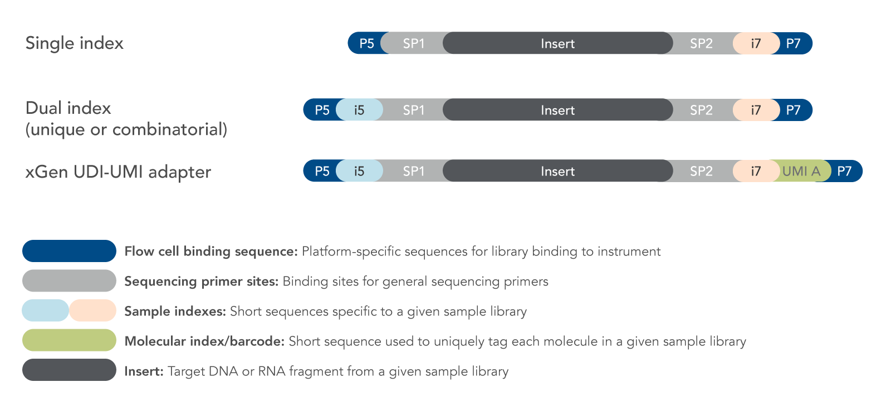
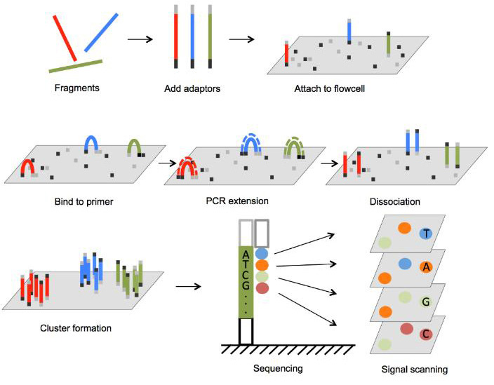
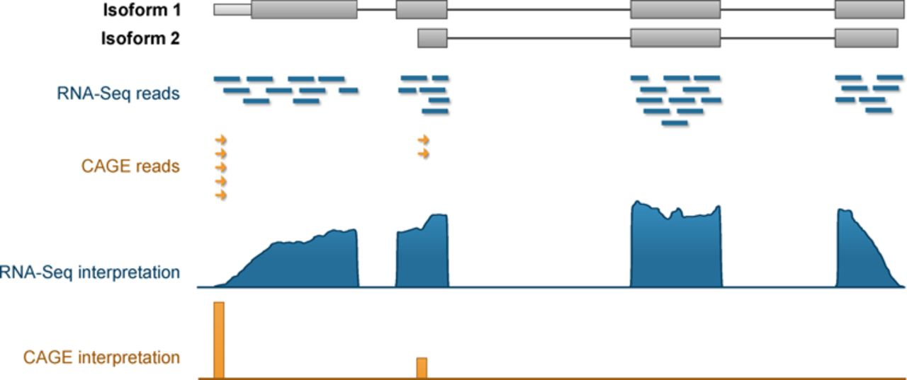
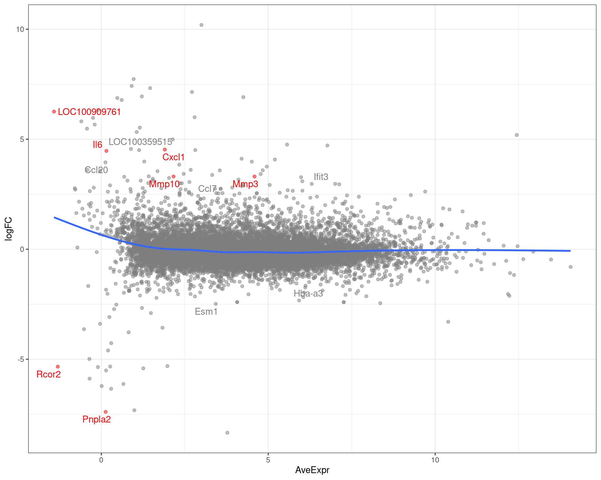
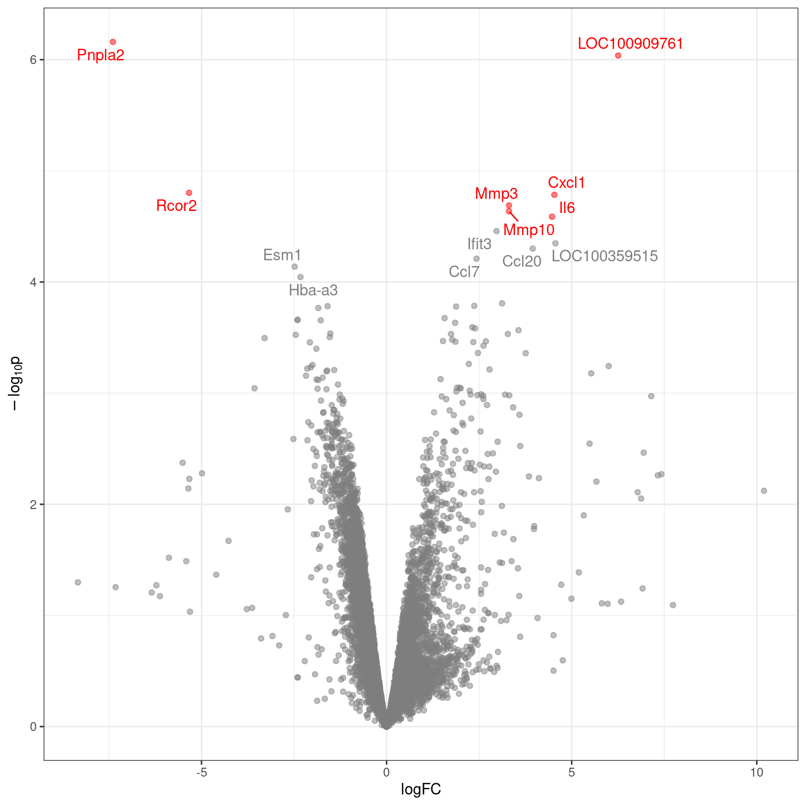

## [Acknowledgement Of Country]{.text-red}

::: {.text-red}

I’d like to acknowledge the Kaurna people as the traditional owners and custodians of the land we know today as the Adelaide Plains, where I live & work.

I also acknowledge the deep feelings of attachment and relationship of the Kaurna people to their place.

I pay my respects to the cultural authority of Aboriginal and Torres Strait Islander peoples from other areas of Australia, and pay my respects to Elders past, present and emerging, and acknowledge any Aboriginal Australians who may be with us today

:::


## RNA Sequencing

According to @Wang2009-hf

> RNA-Seq, also called RNA sequencing, is a particular technology-based sequencing technique which uses next-generation sequencing (NGS) to
reveal the **presence** and **quantity** of RNA in a biological sample at a **given moment**, analyzing the continuously changing cellular transcriptome.


## RNA Sequencing Vs Microarrays {.slide-only .unlisted}

:::: {.columns}

::: {.column}
- Microarrays are still published regularly
    + Also used extensively for methylation
- RNA sequencing is now the dominant technology

::: {.fragment}

- Strong improvement for:
    + transcript-level resolution
    + un-annotated genes 
    + genomic variants
    + allelic bias
    
:::
    
:::
::: {.column}


```{r microarray-vs-rnaseq}
#| echo: false
#| message: false
#| fig-width: 6
#| fig-height: 6
library(tidyverse)
theme_set(theme_bw())
here::here("lectures/assets") %>% 
  fs::dir_ls(glob = "*search.csv") %>% 
  lapply(read_csv) %>% 
  bind_rows(.id = "platform") %>% 
  mutate(
    platform = platform %>% 
      basename() %>% 
      str_remove_all("_search.csv") %>% 
      str_to_title() %>% 
      str_replace_all("Rna", "RNA-")
  ) %>% 
  ggplot(aes(Category, `Publications (total)`)) +
  geom_line(aes(colour = platform), linewidth = 1) +
  ggrepel::geom_label_repel(
    aes(label = label, colour = platform),
    data = . %>% 
      dplyr::filter(Category == max(Category), .by = platform) %>% 
      mutate(
        label = paste0(
          Category, "\n", scales::comma(`Publications (total)`))
      ),
    force_pull = 0, nudge_y = -1000,
    show.legend = FALSE, size = 4, fill = "#FFFFFF90"
  ) +
  ggtitle("Publication search by app.dimension.ai on 26-08-2025") +
  labs(x = "Year", colour = "Platform") +
  scale_y_continuous(labels = scales::comma) +
  scale_x_continuous(
    breaks = seq(2000, as.integer(format(Sys.Date(), format = "%Y")) - 1, by = 5)
  ) +
  scale_colour_brewer(palette = "Set1") +
  theme(
    text = element_text(size = 16),
    plot.title = element_text(face = "italic", size = 14),
    legend.position = "inside",
    legend.position.inside = c(0.99, 0.01),
    legend.justification.inside = c(1, 0)
  )
```
:::
::::

## RNA Sequencing Vs Microarrays {.slide-only .unlisted}

- Microarrays rely on probes for transcripts defined *at design time*
- Restricted in the number of transcripts/genes targeted
    + Arrays are confined for space
    + Gencode 48 (GRCh38): 78,686 genes + 385,669 transcripts
- Probes capture non-specific binding
- Measuring a labelled cDNA: 
    + Fluorescence $\propto$ RNA abundance
    + No sequence information

    
::: {.fragment}
[These limitations do not exist for RNA-Seq]{.text-red}
:::

## RNA Sequencing Vs Microarrays {.slide-only .unlisted}

- Directly sequence the biological material (via cDNA)
- Map to most recent reference at any point in time
- Assemble a transcriptome (tissue specific)
- Detect InDels / SNPs in expressed sequences 
- Detect any allelic bias

::: {.fragment} 

- Multiple variations 
    + total-RNA or polyA transcripts [$\implies$ most similar to microarrays]{.fragment}
    + small-RNA libraries
    + Long Reads (Oxford Nanopore, PacBio) [<br>$\implies$ originally isoform discovery, quantitative methods improving]{.fragment}
    
:::


## The Key Steps

- Focus from here on will be sequencing mRNA using short reads

:::: {.columns}
::: {.column}

::: {.fragment}
1. Library Preparation
    + RNA Quality assessment <br>(i.e. RNA degradation)
    + Selecting target molecules
    + Adding sequencing primers
:::

::: {.fragment}
2. Sequencing 
3. Alignment
:::
:::
::: {.column}

::: {.fragment}
4. Quantitation (i.e. counting)
5. DE Gene Detection
6. Downstream Analysis

:::
:::
::::

## PolyA-Based RNA Selection

1. Select for poly-adenylated RNA using oligo-dT-based methods
    + Only extracts intact mRNA with a polyA tail (includes some ncRNA)


```{r, fig.cap = "Image from https://www.lexogen.com/polya-rna-selection-kit/", out.width='80%'}
#| echo: false
knitr::include_graphics(here::here("lectures/assets/03polya_workflow1.jpg"))
```


## RNA Selection via rRNA Depletion

2. Enzymatically deplete rRNA sequences 
    + rRNA targeted using probes $\implies$ dsRNA degraded
    + Can additionally target hbRNA (whole blood)

```{r, fig.cap = "Image from https://support.illumina.com.cn", out.width='70%'}
#| echo: false
knitr::include_graphics(here::here("lectures/assets/Ribo_Zero_1.jpg"))
```


## Library Preparation

- RNA is then fragmented and size selected (200-300nt)
    + Very short transcripts always lost during this step
- cDNA produced
- Sequencing adapters added
    + Indexes are unique to each individual library $\implies$ always have replicates
    + Optionally contain Unique Molecular Identifiers (UMI)<br>$\implies$ Helps identify PCR duplicates
- Most RNA-Seq now retains *strand-of-origin* information (Stranded RNA-Seq)
    + During PCR only the first cDNA template retained

   
## Library Preparation {.slide-only .unlisted}



## Library Preparation {.slide-only .unlisted}

- Showing the full Y-adapter: Different combinations of indexes, UMI optional

```{r, fig.cap = "Image courtesy of https://sg.idtdna.com", out.width='95%'}
#| echo: false
knitr::include_graphics(here::here("lectures/assets/xgen-udi-umi-adapter-workflow.png"))
```

## Sequencing

:::: {.columns}

::: {.column width='65%'}

{fig-align="left"}
:::
::: {.column width='35%'}
- Standard Illumina short-read sequencing protocol shown
- MGI uses different technology
:::
::::

# Alignment To A Reference Genome

## Reference Genome Alignment

- Sequencing data arrives as FastQ files
    + Standard QC (`FastQC`/`fastp`)
    + Optional Adapter Removal, discarding short & low quality reads etc
- Alignment to a reference genome needs to be splice aware
    + Usually indexed using a set of gene annotations
    + Indexes are dependent on both genome version + annotation version
- Most common aligners are STAR [@Dobin2013-us] & hisat2 [@Kim2019-ib]
    + Alignments returned as SAM/BAM files

## Gene Annotations

- Gene models are now well-annotated for model organisms
    + US maintained: RefSeq; UCSC (https://genome.ucsc.edu)
    + European maintained: EnsEMBL (https://www.ensembl.org/)
- Contain a mix of predicted and observed gene-models
- Human/Mouse also use Gencode (https://www.gencodegenes.org)
- Usually provided as GTF/GFF file
    + Contains exon-, transcript- and gene-level annotations
    + Co-ordinate-based, not sequence-based
    
## Gene Quantitation

- After alignment to a reference gene $\rightarrow$ count reads
    + Leading to Differential Gene Expression analysis
- Multiple high-quality tools: `RSEM` [@Li2011-iu], `featureCounts` [@Liao2014-gy], `htseq` [@htseq2014]
    + Always use the same GTF used when indexing the genome
- Easy in theory but biology is often inconvenient
    + Most alignments will neatly be within exons or across splice junctions
    + Some are not...
    + Some reads align to multiple loci, i.e. multi-mapping

## Gene Quantitation {.slide-only .unlisted}

:::: {.columns}
::: {.column}


```{r count-modes, fig.cap = "Image taken from https://htseq.readthedocs.io/en/latest/htseqcount.html", out.width='90%'}
#| echo: false
knitr::include_graphics(here::here("lectures/assets/count_modes.png"))
```

:::
::: {.column}

How do we count:

- reads that only partially overlap an exon
- reads that map to multiple-locations (i.e. multi-mapping)
- reads where genes are on sense-antisense strand 
- non-canonical splicing events

:::
::::

## Gene Quantitation {.slide-only .unlisted}

- The region encoding a gene is (relatively) well defined
    + An alignment within a gene is easy to assign to that gene
    + Much more difficult to identify which transcript it came from
    
::: {.fragment}
:::: {.columns}

::: {.column width='65%'}


:::

::: {.column width='35%'}

- Many transcripts share multiple exons
- Splice Junctions were the earliest approach

:::


::::
:::


## Count-Based Data

- For RNA-Seq: number of reads aligned to a gene $\rightarrow$ *gene expression*
    + Longer genes will return higher counts $\implies$ not observed in microarrays
- These are *discrete* data (i.e. not continuous values)
- Microarrays were continuous values (fluorescence intensity)
    + Modelled using log~2~-transformed values $\implies \mathcal{N}(\mu, \sigma)$
    + Linear regression, $t$-tests etc
    + Mean and variance are independent variables
    
    
## Count-Based Data {.slide-only .unlisted}

- Count data is commonly modelled using a Poisson Distribution $\implies \text{Poisson}(\lambda)$
    + Good example is number of phone calls per minute at a signal tower
    + Cars per hour in an intersection
- Poisson Distributions define the variance as being equal to the mean 
    + i.e. $\sigma^2 = \mu = \lambda \implies$Mean and variance *are not independent variables*
    + ~~Linear regression, $t$-tests etc~~ Generalised Linear Models (GLMs)
    
::: {.fragment fragment-index=1}
- Biology is inconvenient $\implies$ for RNA-Seq counts $\sigma^2 > \mu$ [$\implies$ *overdispersion*]{.fragment fragment-index=2}
    + Need a different model [$\implies$ The Negative Binomial Distribution]{.fragment fragment-index=3}
    + $\sigma^2$, $\mu$ will still be dependent!
:::

## Count-Based Data {.slide-only .unlisted}

- We use the Negative Binomial distribution to model counts ($y_{gi}$) for gene $g$ in sample $i$ [@Lun2016-vb]
    + The expected counts $E(y_{gi}) =\mu_{gi}$ 
    + With overdispersed variance

$$
\text{var}(y_{gi}) = \sigma^2_g\left(\mu_{gi} +\phi\mu^2_{gi}\right), \text{where } \phi > 0
$$

::: {.fragment}

- Can be thought of as like a Poisson Distribution with extra variation
- Extra variation is strictly defined in quadratic relationship to mean
    + Sometimes described as a combination of *technical* & *biological* variation

:::

## Count-Based Data {.slide-only .unlisted}

- Fit NB *generalised linear models* (GLMs) to model counts and estimate logFC
- Implemented in edgeR [@Chen2016-ig] and DESeq2 [@love2014-ds]
    + Slight differences in model-fitting
    + Overdispersion ($\phi$) moderated in an analogous manner to variance for microarrays e.g. $\phi = \phi(\mu_g)$
    + Both default to FDR-adjusted $p$-values
    

## Count-Based Data {.slide-only .unlisted}

- Poisson/NB-GLMs fit the rate of an event, i.e. counts per fixed measurement window
- Sequencing data produces 'libraries' of counts $\rightarrow$ total counts = *library size*
- In model fitting $\rightarrow$ estimate rate as a function of library size
    
::: {.fragment}
- TMM (edgeR) or RLE (DESeq2) approaches estimate scaling factors
    + Moderates the effect of highly expressed genes which dominate library size
    + e.g. Haemogloblin in blood samples can range between 30-60% of library
    + In a perfect world $\implies$ all scaling factors = 1
- Library size when modelling is multiplied by scaling factors
    + The most effective normalisation methods for RNA-Seq
    
:::

## Count-Based Data {.slide-only .unlisted}

- A common alternative measure is *counts per million* (CPM) or logCPM
    + Mainly used for visualisation *not for analysis*
- CPM is simply counts divided by (library size / 1,000,000)
    + No longer discrete $\implies$ continuous data
- Relationship between mean and variance *still retained* for logCPM
    + Can't use naively in classic `limma`-based linear models

::: {.fragment}
- The limma-voom method [@Law2014-xq] uses weights to break the mean-variance relationship
    + Can assume normally-distributed logCPM values
- Alternatively, the `limma-trend` works effectively

:::

## Alternative Measure for RNA-Seq Counts

- Most designed to scale counts for length
    + Gene length is constant across samples $\implies$ not needed for analysis
- RPKM: Reads Per Kilobase of transcript per Million mapped reads
    + Dominated early RNA-Seq analyses $\implies$ [No longer in common use]{.underline .text-red}
    + Doesn't handle different library compositions like TMM/RLE
    + Effectively makes RPKM not comparable across samples
    + FPKM was 'Fragments Per Kilobase ...' $\implies$ paired reads
- TPM: Transcripts Per Million
    + Divides all counts by gene length
    + Scales across genes so library size is 10^6^ reads
    + Only used for visualisation
    
## Common Visualisation Techniques

:::: {.columns}
::: {.column width='55%'}


:::
::: {.column width='45%'}
- MA Plots show average expression (logCPM) against logFC
- Sometimes called *smear* plots
- Smoothed curve will highlight any bias 
- Low-signal genes usually very noisy
:::
::::

## Common Visualisation Techniques {.slide-only .unlisted}

:::: {.columns}
::: {.column width='55%'}


:::
::: {.column width='45%'}
- Volcano Plots show significance against logFC
- Developed during the microarray era
:::
::::


# Alignment To A Reference Transcriptome

## Reference Transcriptomes

- An alternative to using a reference genome + gene annotations<br>*align to a reference transcriptome*
- No longer need splice-aware aligners
- Genome-based alignments (e.g. BAM files) no longer produced

::: {.fragment}
- Many genes have multiple isoforms which share stretches of the same sequence
- Reads will commonly align to multiple transcripts
- Naive counting no longer viable
:::

## Reference Transcriptomes {.slide-only .unlisted}

- Two very similar approaches:
    + `kallisto` [@Bray2016-qq] pseudo-aligns to a *de Bruijn* graph $\implies$ EM algorithm for counts
    + `salmon` [@Patro2017-sn] aligns to reference $\implies$ EM/VBEM algorithm for counts
- Counts are fitted values (i.e. estimates) based on observed alignments
    + Are *transcript-level counts*
- Alignments are downsampled & bootstrapped $\implies$ estimate of confidence in counts

## Reference Transcriptomes {.slide-only .unlisted}

- Many transcripts within a gene share multiple exons
- Bootstraps provide confidence estimates for difficult/complicated transcripts

{fig-align="left"}

## Differential Transcript Analysis

- Dividing counts by bootstrap estimates $\implies$ Negative Binomial distribution [@Baldoni2024-zf]
    + Standard NB-GLMs applicable
    + Distribution not yet defined otherwise
- Transcript proportions within genes is alternative approach [@Soneson2015-hh]

::: {.fragment}
- Summing transcript counts to gene counts $\implies$ no need for bootstrap estimates
:::


# References

##

::: {.content-visible when-format="beamer"}
\begingroup
\tiny
:::

<!-- This is where the bibliography gets injected -->
:::{#refs}
:::

::: {.content-visible when-format="beamer"}
\endgroup
:::
