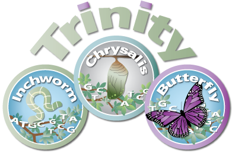
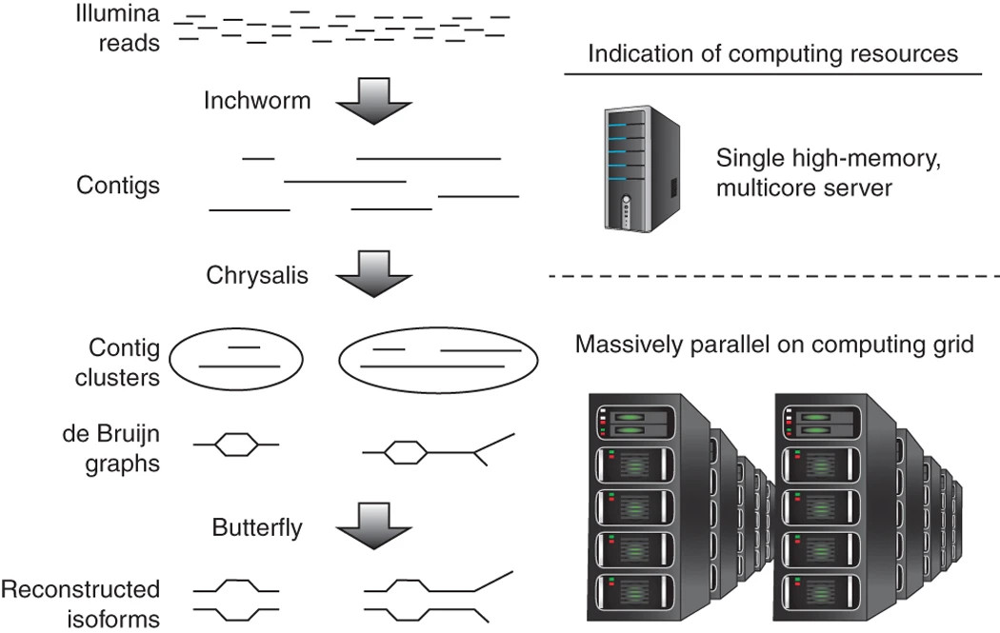
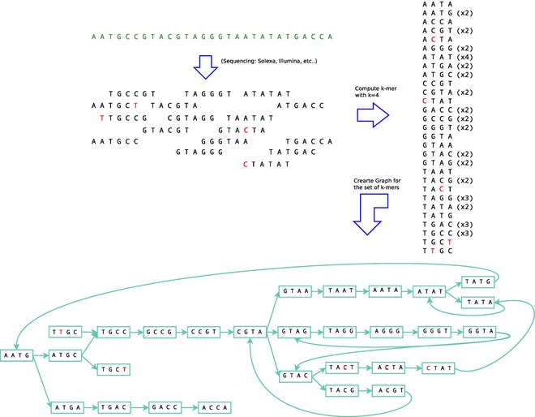
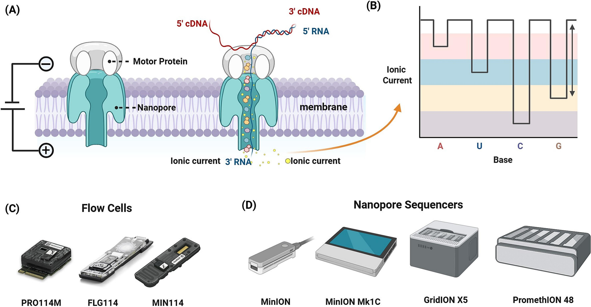
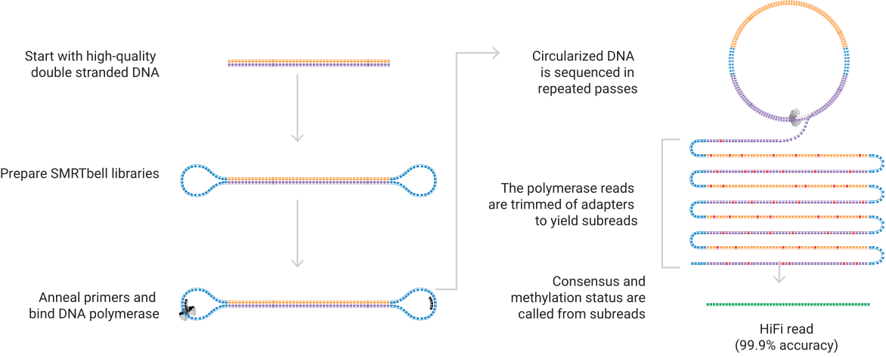

## [Acknowledgement Of Country]{.text-red}

::: {.text-red}

I’d like to acknowledge the Kaurna people as the traditional owners and custodians of the land we know today as the Adelaide Plains, where I live & work.

I also acknowledge the deep feelings of attachment and relationship of the Kaurna people to their place.

I pay my respects to the cultural authority of Aboriginal and Torres Strait Islander peoples from other areas of Australia, and pay my respects to Elders past, present and emerging, and acknowledge any Aboriginal Australians who may be with us today

:::


## Transcript Assembly

- Beyond (or as part of) differential expression analysis $\implies$ *transcriptome assembly*
- Well annotated genomes have gene models defined
    + May only have a reference from related organism
- Biology can be messy & unexpected
    + Unexpected cryptic transcripts
    + Novel TSS, UTRs etc
    + *How well do existing annotations describe our samples*?
- We can assemble *de novo* or using *reference guided* strategies

## Reference Guided Assembly

::: {.notes}
StringTie is the quick & dirty method. Will also turn up some weird artefacts
:::

:::: {.columns}
::: {.column width='60%'}

![Image taken from [@Pertea2015-zd]](assets/stringtie.png){fig-align="left"}
:::
::: {.column width='40%'}

- With a good reference genome $\implies$ *StringTie* can identify novel transcripts
- Un-annotated genes/lncRNA
- Relies on a *splice-graph* to assemble transcripts
- High expression $\implies$ High confidence assembly
- Low expression $\implies$ Less confidence

:::
::::


## Reference Guided Assembly {.slide-only .unlisted}

- StringTie returns a GTF with novel transcripts added to reference (See [here](https://ccb.jhu.edu/software/stringtie/index.shtml?t=manual#output))
    + Gene & Transcript annotations capture the entire transcribed region
    + Exons are annotated by transcript + gene
- Can merge assemblies across libraries/samples
    + Use merged GTF to obtain counts with `featureCounts` etc
    + Also returns counts for DE analysis


## Full Transcriptome Assembly

{.absolute top=180 right=30 width='20%'}

- Complete *de novo* transcriptome assembly using Trinity [@Grabherr2011-bh]
    + Far more computationally demanding than *StringTie*
    + Can also perform a *reference-guided assembly* 
- Best option where no reference genome is available
    + Or reference is low quality
- Will be tissue specific $\implies$ a subset of transcripts will be assembled
- Returns a fasta file naive to any reference genome
    + Gene/Transcript clusters in sequence header

## Full Transcriptome Assembly {.slide-only .unlisted}

:::: {.columns}
::: {.column width='60%'}
{fig-align="left"}
:::

::: {.column width='40%'}
1. Inchworm
    + Naively assembles reads into contigs
2. Chrysalis
    + Pools contigs into *de Bruijn* graph
3. Butterfly
    + Trims *de Bruijn* graph and compares against raw reads

:::
::::


## De Bruijn Graphs

:::: {.columns}
::: {.column width='60%'}


:::

::: {.column width='40%'}
- Reads represent fragmented transcripts
- Reads broken into shorter *k*-mers
- Adjacent *k*-mers $\rightarrow$ graph
- Wise choice of *k* helps extend graph well beyond read length
- Different *k* $\implies$ different assembly
- Well-represented paths through graph $\rightarrow$ transcripts
:::

::::

## A Trinity Assembled Transcriptome

- Assembly returns a Fasta file with all assembled transcripts

```
 >TRINITY_DN1000_c115_g5_i1 len=247 path=[31015:0-148 23018:149-246]
 AATCTTTTTTGGTATTGGCAGTACTGTGCTCTGGGTAGTGATTAGGGCAAAAGAAGACAC
 ACAATAAAGAACCAGGTGTTAGACGTCAGCAAGTCAAGGCCTTGGTTCTCAGCAGACAGA
 AGACAGCCCTTCTCAATCCTCATCCCTTCCCTGAACAGACATGTCTTCTGCAAGCTTCTC
 CAAGTCAGTTGTTCACAGGAACATCATCAGAATAAATTTGAAATTATGATTAGTATCTGA
 TAAAGCA
```

- Read cluster `TRINITY_DN1000_c115`; Gene `g5`; Isoform `i1`
- Pathway through graph is output
- If diploid organism $\rightarrow$ both maternal & paternal transcripts

## Assessing Assembly Quality

- Benchmarking Universal Single-Copy Orthologs (BUSCO) [@Tegenfeldt2025-lt]
    + Checks expected genes conserved across species
    + Assess assembly quality against expected true positives
    + Most (but not all) orthologs expressed in assembled tissue

::: {.fragment}
- Example BUSCO output: **C:89.0%[S:85.8%,D:3.2%],F:6.9%,M:4.1%,n:3023**
    + **C**: Complete orthologs
        + **S**: Single copy + **D**: Duplicated copy
    + **F**: Fragmented copy
    + **M**: Missing copy
    + **n**: Total orthologs

:::


# Long Read Technology

## Long Read Technology

- Most transcriptome assemblies performed using Trinity/StringTie
    + Illumina reads $\leq$ 2x150nt
- Long Reads are becoming dominant for assemblies
    + Sequence (near-)complete transcripts
- Capture "difficult" transcripts:
    + Transposable Elements (TEs)
    + *DUX4* within repeat array with 11-150 repeats
- Quantification approaching short-read consistency
    + Overcomes fragmentation bias in short-read technology [@Chen2025-sh]
    
## Long Read Technology


```{r ont-isoforms, fig.align='left', out.width='60%', fig.cap = "Image from @Gleeson2021-nc. Isoforms observed in SH-5Y5Y cells" }
#| echo: false
knitr::include_graphics(here::here("lectures/assets/gkab1129fig5c.jpg"))
```


## Oxford Nanopore (ONT)

:::: {.columns}

::: {.column width='63%'}
    

:::

::: {.column width='37%'}
- From 50 bp to >4 Mb
- Can directly sequence RNA
    + No PCR bias
    + RNA-modifications
- Also cDNA sequencing
- Errors corrected using deep learning

:::
::::
    
## Pacific Biosciences (PacBio)    

:::: {.columns}

::: {.column width='63%'}

:::

::: {.column width='37%'}
- PacBio IsoSeq:
    + Up to 25kb
    + Sequence cDNA only
    + Circularisation $\implies$ Highly accurate reads
    
:::
::::
    

# References

##

::: {.content-visible when-format="beamer"}
\begingroup
\scriptsize
:::

<!-- This is where the bibliography gets injected -->
:::{#refs}
:::

::: {.content-visible when-format="beamer"}
\endgroup
:::
